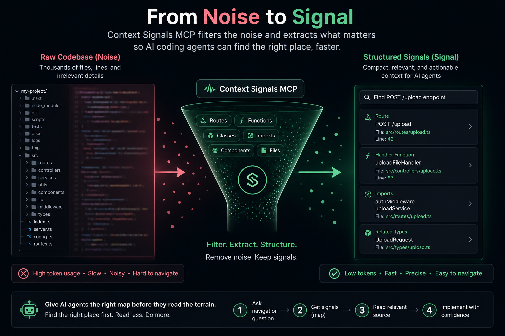

# Context Signals MCP

[](https://www.npmjs.com/package/context-signals-mcp)
[](https://www.npmjs.com/package/context-signals-mcp)
[](./LICENSE)



Works with Claude Desktop, OpenCode, Cursor/Roo-style MCP clients, and any MCP-compatible coding agent.

**Stop coding agents from wasting context while finding where things live in your codebase.**

Context Signals MCP gives AI coding agents a compact structural map of your project — routes, functions, classes, imports, files, and line numbers — before they read full source files.

Instead of blindly opening multiple files, the agent can ask:

> “Where is the upload endpoint?”  
> “Which function handles authentication?”  
> “What routes exist in this service?”  
> “Where is this class/component defined?”

And get precise structural signals first.

---

## Why this exists

AI coding agents are good at editing code once they know where to work.

But they often waste a lot of context during discovery:

1. Search keywords
2. Open multiple full files
3. Read unrelated implementation details
4. Repeat the same discovery work again later

That creates:

- high token usage
- slower responses
- noisy context
- less room for actual reasoning
- wrong-file exploration

Context Signals MCP solves the navigation problem first.

It does **not** replace reading source code.  
It helps agents find the right place before reading source code.

---

## Before vs After

Query:

> Where is the `POST /upload` endpoint?

### Without Context Signals

The agent may read:

```text
src/server.ts
src/routes/index.ts
src/routes/upload.ts
src/controllers/uploadController.ts
src/middleware/auth.ts
```

Often this costs thousands of tokens before the agent even knows where the endpoint lives.

### With Context Signals

The agent first receives compact metadata:

```text
route: POST /upload
file: src/routes/upload.ts
line: 42
handler: uploadFileHandler
imports:
  - authMiddleware
  - uploadService
```

Then it can read only the relevant file or line range.

---

## Quick start

```bash
npm install -g context-signals-mcp
```

Or use with npx:

```bash
npx context-signals-mcp
```

---

## What it extracts

Context Signals MCP builds a local signal store containing:

- functions
- classes
- interfaces/types
- imports
- API routes
- React components
- file paths
- line numbers

Signals are a map, not the territory.
Source code remains the ground truth.

---

## Benchmark results

Tested on real projects.

| Project          | Files     | Code Size  | Context Reduction |
| ---------------- | --------- | ---------- | ----------------- |
| Cal.com TRPC     | 426 files | 880K chars | 81%               |
| Trigger.dev Core | 246 files | 1.3M chars | 95%               |
| PhotoVerify      | 24 files  | 39K chars  | 79%               |

### Key metrics

| Metric               | Result        | Notes                            |
| -------------------- | ------------- | -------------------------------- |
| Context reduction    | 81–95%        | Warm-cache navigation queries    |
| Top-3 hit rate       | 100%          | Evaluated benchmark queries only |
| Signal lookup speed  | 5–29x faster  | Compared with reading files      |
| Break-even point     | ~5–15 queries | Depends on project size          |
| Auto-indexing        | Yes           | Indexes on startup               |
| Incremental indexing | Yes           | Re-indexes changed files only    |

These results apply mainly to navigation and discovery queries, not full implementation reasoning.

---

## When this works best

Context Signals MCP is useful when:

- the project has 50+ files
- agents repeatedly ask “where is…”, “find…”, “show routes…”
- the codebase is JavaScript or TypeScript
- the agent needs to locate files/functions/routes before editing
- the workflow is long-lived, not one-off

---

## When not to use it

This is probably not useful for:

- very small projects
- one-off questions
- cold-start-only usage
- deep implementation reasoning where the full source must be read anyway
- unsupported languages where structural extraction is limited

---

## OpenCode setup

Add to your MCP configuration:

```json
{
  "mcp": {
    "context-signals": {
      "type": "stdio",
      "command": "npx",
      "args": ["context-signals-mcp"],
      "env": {
        "WORKTREE": "${PWD}"
      }
    }
  }
}
```

---

## Claude Desktop setup

Add to:

`~/Library/Application Support/Claude/claude_desktop_config.json`

```json
{
  "mcpServers": {
    "context-signals": {
      "command": "npx",
      "args": ["context-signals-mcp"]
    }
  }
}
```

---

## Recommended agent workflow

1. Start the MCP server
2. Let it auto-index the project
3. Ask navigation/discovery questions using `signals_search`
4. Use returned file paths and line numbers
5. Read source only when implementation details are needed
6. Changed files are re-indexed automatically

---

## Cold start vs warm cache

| Mode        | What happens                  | Result                      |
| ----------- | ----------------------------- | --------------------------- |
| Cold start  | Initial indexing              | First query may not benefit |
| Warm cache  | Signals already indexed       | Highest context savings     |
| Incremental | Only changed files re-indexed | Faster updates              |

---

## Language support

| Language   | Status           | Notes                     |
| ---------- | ---------------- | ------------------------- |
| JavaScript | Production-ready | AST extraction            |
| TypeScript | Production-ready | AST extraction            |
| Python     | Experimental     | Native Python AST planned |
| Go         | Planned          | Future support            |
| Rust       | Planned          | Future support            |
| Java       | Planned          | Future support            |

---

## Why not just use RAG?

RAG is useful for semantic similarity.

Context Signals MCP is different.

RAG asks:

> “Which code chunks are semantically similar to this query?”

Context Signals asks:

> “Which structural entry points match this route, function, class, component, import, or file?”

They can work together.

Use Context Signals first for navigation.
Use RAG or source reads later for deeper reasoning.

---

## Privacy

- No code is sent to external servers
- Signal store is local
- Users control generated signal files
- Designed for local coding-agent workflows

---

## Current scope

This project focuses on one narrow problem:

**Reduce unnecessary source-file reading during codebase discovery.**

It is not trying to be:

- a full semantic code search engine
- a replacement for LSP
- a replacement for source-code reading
- a complete coding-agent memory system

---

## Roadmap

- native Python AST support
- framework-specific extractors
  - Django
  - Flask
  - Express
  - Fastify
  - Next.js
- optional LSP enrichment
- query intent detection
- targeted file/range read support
- stronger benchmark harness
- comparison with grep, ripgrep, LSP, and semantic search

---

## License

MIT
