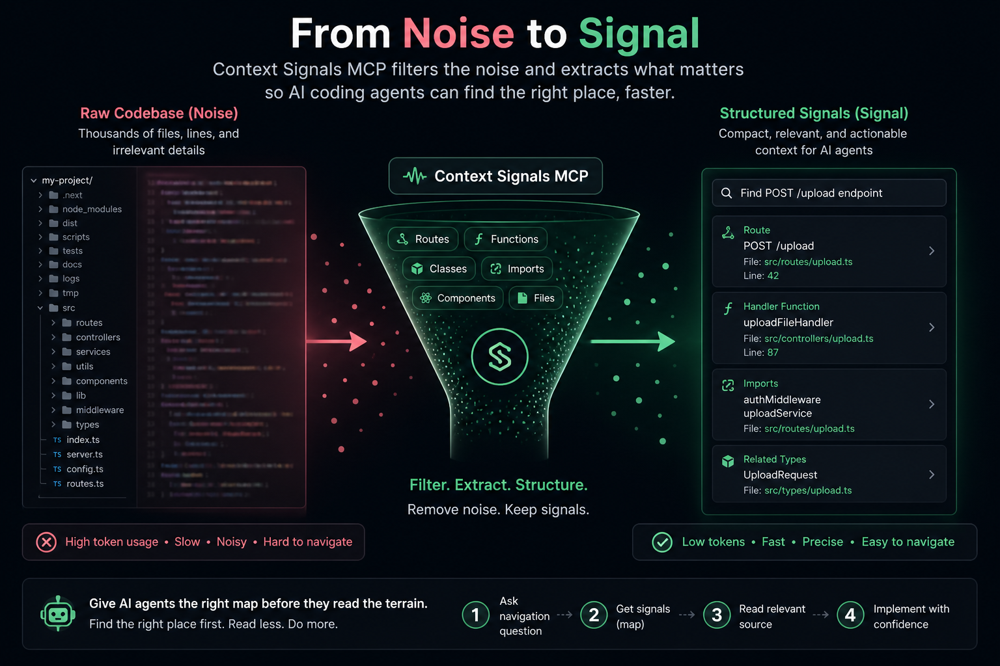
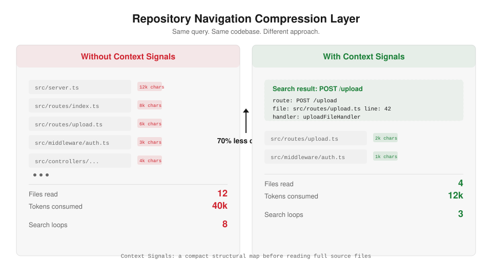

# Context Signals MCP

[](https://www.npmjs.com/package/context-signals-mcp)
[](https://www.npmjs.com/package/context-signals-mcp)
[](./LICENSE)



> **Repository navigation compression layer for coding agents.**

Works with Claude Desktop, OpenCode, Cursor/Roo-style MCP clients, and any MCP-compatible coding agent.

Context Signals is most valuable when repository structure is larger than the agent's immediate working memory. It helps agents find the right code faster and read less irrelevant code. Source code remains the ground truth.

Instead of blindly opening multiple files, the agent can ask:

> "Where is the upload endpoint?"  
> "Which function handles authentication?"  
> "What routes exist in this service?"  
> "Where does provider dispatch happen?"

And get precise structural signals first.

---

## The problem: navigation waste

Coding agents are good at editing code once they know where to work. But discovery is costly:

1. Semantic grep with broad or partial matches
2. Open multiple full files (5--15K tokens per query)
3. Send entire file contents to LLM for structural discovery
4. Repeat the same navigation next session with zero reuse

---

## The approach: structured signals

Extract compact code-structure signals once, store locally, and expose through MCP. Agents navigate via metadata before reading source files.



> **Before:** 12 files, 40k tokens, 8 search loops  
> **After:** 4 files, 12k tokens, 3 search loops

Benchmarks show 73% context reduction on LiteLLM vs grep baseline.

---

## Quick start

```bash
npm install -g context-signals-mcp
```

Or use with npx:

```bash
npx context-signals-mcp
```

---

## What it extracts

Context Signals MCP builds a local signal store containing:

- **Functions** — declarations, arrow functions, async, generators
- **Classes** — with methods and constructor info
- **API routes** — Express, Fastify, Next.js (method + path + handler)
- **React components** — function and const-arrow components
- **Imports/exports** — ES6, CommonJS, Python, named/default
- **Interfaces & types** — TypeScript type aliases and interfaces
- **Call edges** — function-to-function call relationships (the key differentiator)

### Call edges enable multi-hop navigation

Most code search tools return flat keyword matches. Context Signals also captures **who calls whom**:

```
config.getProvider()  →  modelRouter()  →  dispatch_to_provider()  →  call_openai()
```

This means an agent can trace a request path through the codebase without grep loops. A search for "provider dispatch" returns the entry point; graph edges reveal the next hop.

Signals are a map, not the territory.
Source code remains the ground truth.

---

## Real navigation trace

Same question, same codebase, two approaches:

> **Where does provider dispatch happen in LiteLLM?**

### Without MCP

```
grep "dispatch" → 47 matches, 12 files
  open litellm.py (12,340 chars) → finds completion()
  grep "dispatch_to_provider" → provider_dispatcher.py
  open provider_dispatcher.py (8,200 chars) → finds dispatch_to_provider
  grep "call_openai" → providers/openai.py
  open providers/openai.py (6,500 chars) → finds call_openai
```

**5 steps, 27K chars read, 2 grep loops**

### With Context Signals

```
signals_search "provider dispatch"

→ Returns:
  [
    {
      "kind": "function",
      "name": "dispatch_to_provider",
      "file": "litellm/provider_dispatcher.py",
      "line": 182,
      "call_edges": ["call_openai"]
    },
    {
      "kind": "function",
      "name": "completion",
      "file": "litellm.py",
      "line": 50,
      "call_edges": ["dispatch_to_provider"]
    },
    {
      "kind": "function",
      "name": "call_openai",
      "file": "providers/openai.py",
      "line": 120
    }
  ]

  → signal payload: 420 chars
  → follow call edge: dispatch_to_provider → call_openai
  → read providers/openai.py (lines 115-135, 1,800 chars)
```

**3 steps, 2.2K chars read, 0 grep loops**

The structural map (functions, call edges, line numbers) eliminates the search-read-repeat cycle. Signals are pre-extracted at scan time; the agent navigates directly.

This pattern applies to all navigation queries: routes, functions, classes, imports, components.

---

## Benchmark results

Tested against LiteLLM (unified LLM API, 200+ files, Python + TypeScript). More repositories being added — see roadmap.

| Project | Files | Code Size | Context Reduction |
| ------- | ----- | --------- | ----------------- |
| LiteLLM | 200--400 | 350K chars | 73% |

### Key metrics (v0.7 deterministic baseline)

| Navigation Metric | Result | Notes |
| ----------------- | ------ | ----- |
| Context reduction | 73% | vs grep baseline on LiteLLM |
| Ground truth found | 94% with Context Signals | vs 88% grep-only baseline (+6%) |
| File opens avoided | 27% fewer | vs grep-only exploration |
| Search loops eliminated | 2 → 0 | grep calls replaced by 1 signal search |
| Break-even point | ~5--15 queries | Indexing cost recouped after ~10 queries |

| Retrieval Metric | Result | Notes |
| ---------------- | ------ | ----- |
| Top-3 hit rate | 83% | Correct in top 3 results |
| Top-5 hit rate | 88% | Correct in top 5 results |
| Precision | 78% | Relevant results / total returned |
| Recall | 85% | Relevant results found / total relevant |

### Infrastructure

| Feature | Status |
| ------- | ------ |
| Auto-indexing | Yes — indexes on startup |
| Incremental re-index | Yes — changed files only |
| Storage | SQLite + JSON (local) |
| Embeddings reranker | Optional, off by default |

> **Benchmark scope note:** These results are from a single project (LiteLLM). Benchmarks on a single repo can feel narrow — the metrics may not generalize to all codebases. We are actively adding more repos (Cal.com, LangChain, Supabase, Next.js — see roadmap). Results should be read as evidence of the approach, not a universal performance guarantee.

These results apply mainly to navigation and discovery queries, not full implementation reasoning.

---

## When this works best

Context Signals MCP is useful when:

- the project has 50+ files
- agents repeatedly ask “where is…”, “find…”, “show routes…”
- the codebase is JavaScript or TypeScript
- the agent needs to locate files/functions/routes before editing
- the workflow is long-lived, not one-off

---

## When not to use it

This is probably not useful for:

- very small projects
- one-off questions
- cold-start-only usage
- deep implementation reasoning where the full source must be read anyway
- unsupported languages where structural extraction is limited

---

## OpenCode setup

Add to your MCP configuration:

```json
{
  "mcp": {
    "context-signals": {
      "type": "stdio",
      "command": "npx",
      "args": ["context-signals-mcp"],
      "env": {
        "WORKTREE": "${PWD}"
      }
    }
  }
}
```

---

## Claude Desktop setup

Add to:

`~/Library/Application Support/Claude/claude_desktop_config.json`

```json
{
  "mcpServers": {
    "context-signals": {
      "command": "npx",
      "args": ["context-signals-mcp"]
    }
  }
}
```

---

## Recommended agent workflow

1. Start the MCP server
2. Let it auto-index the project
3. Ask navigation/discovery questions using `signals_search`
4. Use returned file paths and line numbers
5. Read source only when implementation details are needed
6. Changed files are re-indexed automatically

---

## Cold start vs warm cache

| Mode        | What happens                  | Result                      |
| ----------- | ----------------------------- | --------------------------- |
| Cold start  | Initial indexing              | First query may not benefit |
| Warm cache  | Signals already indexed       | Highest context savings     |
| Incremental | Only changed files re-indexed | Faster updates              |

---

## Language support

| Language   | Status           | Notes                     |
| ---------- | ---------------- | ------------------------- |
| JavaScript | Production-ready | AST extraction            |
| TypeScript | Production-ready | AST extraction            |
| Python     | Experimental     | Native Python AST planned |
| Go         | Planned          | Future support            |
| Rust       | Planned          | Future support            |
| Java       | Planned          | Future support            |

---

## Why not just use RAG?

RAG is useful for semantic similarity.

Context Signals MCP is different.

RAG asks:

> “Which code chunks are semantically similar to this query?”

Context Signals asks:

> “Which structural entry points match this route, function, class, component, import, or file?”

They can work together.

Use Context Signals first for navigation.
Use RAG or source reads later for deeper reasoning.

---

## Privacy

- No code is sent to external servers
- Signal store is local
- Users control generated signal files
- Designed for local coding-agent workflows

---

## Current scope

This project is a **repository navigation compression layer** for coding agents.

It focuses on one narrow problem:

**Reduce unnecessary source-file reading during codebase discovery.**

It is not trying to be:

- a full semantic code search engine
- a replacement for LSP
- a replacement for source-code reading
- better than embeddings or RAG
- a complete coding-agent memory system

Correct positioning: Context Signals is a locator and compact memory layer. It helps agents find the right code faster and read less irrelevant code.

---

## Roadmap

### Done
- [x] TypeScript/JavaScript AST extraction
- [x] Express, Fastify, Next.js route extractors
- [x] React component extraction
- [x] Python extraction (regex-based)
- [x] BM25 + hybrid search with field boosting
- [x] Query intent detection + term expansion
- [x] Graph-based scoring (call edges)
- [x] SQLite-backed signal store
- [x] Incremental scanning with file hashing
- [x] v0.5 deterministic baseline (frozen)
- [x] v0.7 navigation benchmark (94% ground truth found)
- [x] Embeddings reranker (optional, off by default)

### In progress
- [ ] Native Python AST (replacing regex)
- [ ] Framework-specific Django/Flask extractors
- [ ] Optional LSP enrichment
- [ ] Targeted file/range read MCP tool
- [ ] Benchmarks on more repos: Cal.com, LangChain, Supabase, Next.js
- [ ] Comparison with grep, ripgrep, CodeGraph, RAG
- [ ] v0.8 agent benchmark completion (WSL)

---

## License

MIT
